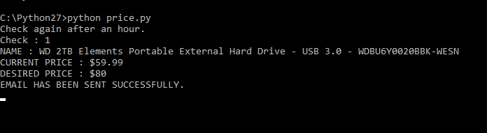

# Amazon Prices

This project was written in Python in order to practice web scraping:

  - Tracking a certain Amazon prodcut's price throughout the day
  - Sending emails to provided email with updates when the price drops below the desired price


### Tech

This project is solely using the Python programming language. I also used BeautifulSoup4, requests, re  and notify for this project.
**Download BeautifulSoup4:**
```sh
$pip install beautifulsoup4
```
**Download Requests**
```sh
$pip install requests
```


### Try it out

All you need to run this project on your computer is git and an IDE of your choice that can run Python applications. I am using IDLE to write this. You can download Python from here https://www.python.org/downloads/.

To clone this project, what I did first was create a folder on my machine where I wanted to download the project to. Then, copy the directoy of the folder that you just created. 
Open a terminal and "cd" into the folder. Then follow the steps below:

```sh
$git init
$git pull https://github.com/Abruuham/Amazon-Prices.git
```

And that is it!

If you dont want to use git, then just click on the "clone or download" button and download the .zip file to your computer.


### Todos

 - Allow for multiple items to be tracked
 - Create a GUI in Python to make the application more user friendly

License
----

MIT

**Just for Fun!**

Feel free to follow me on [instagram] or on my [linked in]! I'm still and always will be learning and practicing new ways of programming so if you have any suggestions, please message me and help me learn something new!

**Programming, Hell Yeah!**


   [git-repo-url]: <https://github.com/Abruuham/Amazon-Prices.git>
   [linked in]: <https://www.linkedin.com/in/abraham-calvillo/>
   [instagram]: <https://www.instagram.com/abruuh_ham>
   [python]: <https://www.python.org/downloads/>
